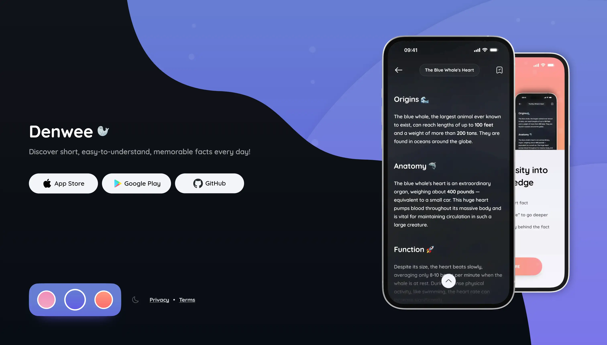

<h1 align="center">
  FactlyApp Landing
  <br>
</h1>

<h4 align="center">Simple landing page built with Flutter Web for <a href="https://github.com/denweeLabs/factlyapp" target="_blank">Denwee FactlyApp</a></h4>

<p align="center">
  <a href="https://flutter.dev"></a>

  <a href="https://dart.dev">
      
  </a>
</p>


[](https://www.denwee.com)


## 🎨 Features & Tech

- Multi-language support with [easy_localization](https://pub.dev/packages/easy_localization)
- Lightweight animations using [animate_do](https://pub.dev/packages/animate_do)
- Dark/Light mode support
- Path navigation with [go_router](https://pub.dev/packages/go_router)
- Static icons from [Iconsax](https://iconsax.io)
- Animated emojis from [Noto Animated Emojis](https://googlefonts.github.io/noto-emoji-animation/) — licensed under [CC BY 4.0](https://creativecommons.org/licenses/by/4.0/legalcode)


## 🚀 How To Run

To run this application, you'll need [Flutter](https://flutter.dev) of version `3.32` or higher:

```bash
# Get all packages
flutter pub get

# Generate localization files
flutter pub run easy_localization:generate -S "assets/translations" -O "lib/localization"

# Generate localization keys
flutter pub run easy_localization:generate -S "assets/translations" -O "lib/localization" -o "locale_keys.g.dart" -f keys

# Run the app
flutter run -d chrome --wasm
```

> **Note:**
> To run the app on other devices, use `flutter run -d web-server --wasm` and open the localhost URL shown in the console


## ⚒️ How To Build

```bash
# Build using default JS backend (dart2js)
flutter build web --release

# Build using WebAssembly backend (Wasm-enabled)
flutter build web --release --wasm
```


## 🤝 How To Contribute

Denwee projects are crafted by a solo enthusiastic developer across Mobile, Web, and Backend technologies. Your contributions, no matter how big or small, are always welcome! Here’s how you can help:

* **Open PR's** – fix bugs, add features, or improve existing code.
* **Submit Issues** – report bugs, request features, or suggest improvements.


## ❤️ Support

For any questions or support, please reach out to support@denwee.com 🫶

<a href="https://buymeacoffee.com/denweelabs" target="_blank"></a>


## 📃 License

[](https://opensource.org/licenses/MIT)
